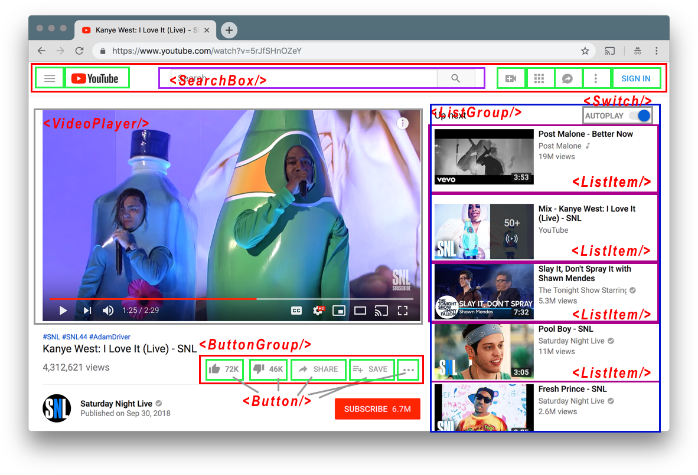
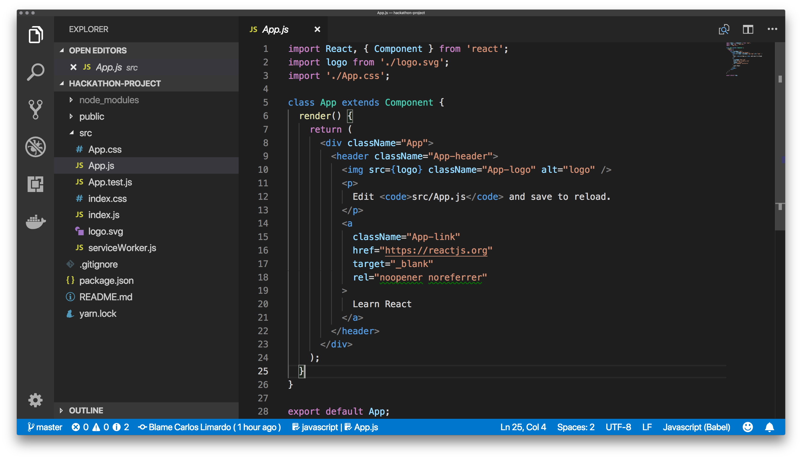
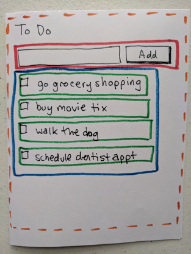

import { Head, Appear, Code } from 'mdx-deck'
import { Invert, Split , SplitRight } from 'mdx-deck/layouts'
import { CodeSurfer, components } from 'mdx-deck-code-surfer'
import Typing from 'react-typing-animation'
import Window from './lib/Window.js'

import List from './lib/List'
import App from './lib/App.js'

import { default as mdxTheme } from 'mdx-deck/themes'
import nightOwl from "prism-react-renderer/themes/nightOwl"

export const theme = {
  ...mdxTheme,
  codeSurfer: {
    ...nightOwl,
    showNumbers: true
  }
}
export { components } from "mdx-deck-code-surfer"


<Head>
  <title>Intro To React</title>
</Head>

# Intro to React
## By iCIMS
---
export default Split


## Carlos G. Limardo
### UI Developer @ iCIMS

---


---

## Agenda

- What is React?
- Benefits of React
- Tutorial and Quick Overview
- How we use React at iCIMS

<small>Assumption: Basic knowledge of HTML/CSS/Javascript</small>

Follow along on Codepen:
https://goo.gl/Rbbhi4

Links and code examples available on GitHub:
https://github.com/iCIMS-inc/intro-to-react-presentation

---
export default Invert

## What is React?


---

A javascript library for building user interfaces

---

It encourages the creation of reusable UI components

---

<video width="100%" height="auto" autoPlay loop controls>
  <source src="media/youtube.mov" />
</video>

---



---
export default Invert

## Benefits of React

---

Virtual DOM

---

It's not a framework, it's a library

---

Components

---

Easy to learn

---
export default Invert

## What do I need to know?

---

Javascript

---

JSX

---

<CodeSurfer
  code={require("raw-loader!./snippets/helloWorld.snippet")}
  title="Hello World"
  notes=""
  steps={[
    { range: [ 3, 12 ], notes: "Plain Javascript" },
    { range: [ 16, 25 ], notes: "Using JSX" },
    { lines: [ 5, 18 ] },
    { lines: [ 23, 10 ] }
  ]}
  showNumbers
/>

---

export default Invert

## Setting up your application

---

export default Split


## create-react-app

- babel
- webpack
- webpack-dev-server

---

`#> npx create-react-app hackathon-project`

<Appear>
  <div></div>
</Appear>

---
export default Split



<div style={{position: 'relative'}}>
<Appear>
<div><div style={{borderColor: 'orange', borderStyle: 'dashed', borderWidth: '3px', width: '100%', height: '400px'}}>App</div></div>
<div><span style={{borderColor: 'red', borderStyle: 'solid', borderWidth: '3px', padding: '10px', position: 'absolute', width: '90%', top: '30px', left: '10px', background: 'white'}}>Form</span></div>
<div><span style={{borderColor: 'blue', borderStyle: 'solid', borderWidth: '3px', padding: '10px', position: 'absolute', width: '90%', height: '200px', top: '80px', left: '10px', background: 'white'}}>List</span></div>
<div><span style={{borderColor: 'green', borderStyle: 'solid', borderWidth: '3px', padding: '10px', position: 'absolute', width: '80%', top: '120px', left: '20px', background: 'white'}}>ListItem</span></div>
</Appear>
</div>

---

```javascript Form.jsx
import React from 'react';

const Form = (props) => {
  return (
    <form>
      <input type="text" value={props.value} />
      <button type="submit">Add</button>
    </form>
  )
}

export default Form;
----
* > Form.js
1 > Always import React
3:10 > Form component code
3[8:10], 6[7:11]> Define the props
12 > Export Form component for reuse

```

---
export default Split


`<Form value="go pumpkin picking" />`

<form><input type="text" value="go pumpkin picking" style={{fontSize: '30px'}} /><button type="submit" style={{fontSize: '30px'}}>Add</button></form>

---

```javascript ListItem.jsx
import React from 'react';

const ListItem = (props) => {
  return (
    <div>
      <input type='checkbox' />
      {props.children}
    </div>
  )
}

export default ListItem;
----
* > ListItem.js
3[5:11], 7 > Children prop
```
---
export default Split


`<ListItem>go pumpkin picking</ListItem>`

<div style={{fontSize: '30px'}}><input type="checkbox" style={{width: '30px', height: '30px'}} />go pumpkin picking</div>

---

```javascript List.jsx
import React from 'react';
import PropTypes from 'prop-types';
import ListItem from './ListItem.jsx';

const List = (props) => {
  const todoList = props.todos.map((todo) => {
    return (
      <ListItem key={todo.key}>{todo.text}</ListItem>
    )
  });

  return (
    <div>
      {todoList}
    </div>
  )
}

export default List;
----
3 > Import the ListItem component for reuse
6:10 > Todo's is an array that we loop through
11:16 > Return the ListItems
* > List
```

---
export default Split


`<List todos={
  {
    text: 'Task One',
    key: 1
  },
  {
    text: 'Task two',
    key: 2
  }
}/>`

<List todos={[{text: 'Task One', key: 1}, {text: 'Task two', key: 2}]} />

---

```javascript mockList.js
export default [
	{
		"text": "go grocery shopping",
		"key": "1519242727"
	},
	{
		"text": "buy movie tix",
		"key": "1519242736"
	},
	{
		"text": "walk the dog",
		"key": "1519242744"
	},
	{
		"text": "schedule dentist appt",
		"key": "1519242752"
	}
]
----
* > Let's give our app some data
4,8,12,16 > Keys are unique (timestamp)
```

---

```javascript App.js
import React from 'react';
import Form from './Form.jsx';
import List from './List.jsx';
import initialTodos from './mocksTodos.js';

class App extends React.Component {
  render() {
    return (
      <div>
        <h1>{this.props.title}</h1>
        <Form />
        <List todos={initialTodos} />
      </div>
    )
  }
}

export default App;
----
* > Replace your App.js
6 > Class based component (extends React.Component)
7:15 > render() for every React.Component
10 > Props are available in this.props object
4,12 > Pass the initialTodos to List component
```
---
export default Split


`<App />`

<div style={{textAlign: 'left'}}>
  <h1>To-Do App</h1>
  <form><input type="text" style={{fontSize: '30px'}} /><button type="submit" style={{fontSize: '30px'}}>Add</button></form>
  <div>
    <div style={{fontSize: '30px'}}><input type="checkbox" style={{width: '30px', height: '30px'}} /> go grocery shopping</div>
    <div style={{fontSize: '30px'}}><input type="checkbox" style={{width: '30px', height: '30px'}} /> buy movie tix</div>
    <div style={{fontSize: '30px'}}><input type="checkbox" style={{width: '30px', height: '30px'}} /> walk the dog</div>
    <div style={{fontSize: '30px'}}><input type="checkbox" style={{width: '30px', height: '30px'}} /> schedule dentist appt</div>
  </div>
</div>

---

```javascript Form.jsx
import React from 'react';

const Form = (props) => {
  return (
    <form onSubmit={props.onSubmit}>
      <input type="text" value={props.value} onChange={props.onChange} />
      <button type="submit">Add</button>
    </form>
  )
}

export default Form;
----
* > Form.jsx
5[2:8], 6[12:18] > Added new onChange and onSubmit props
```

---
<CodeSurfer
  code={require("raw-loader!./snippets/App.snippet")}
  title="App.jsx"
  notes=""
  steps={[
    {},
    { range: [ 7, 16 ], notes: "Constructor initializes our component" },
    { range: [ 9, 12 ], notes: "Setup our state" },
    { range: [ 18, 20 ], notes: "Update the state when inputValue changes" },
    { range: [ 22, 34 ], notes: "Add the inputValue to the todos state and reset the inputValue state" },
    { lines: [ 14, 15 ], notes: "Bind the functions" },
    { lines: [ 41 ], notes: "Set the value to inputValue from the state"},
    { lines: [ 42, 43 ], notes: "Pass the functions as props to the Form" }
  ]}
  showNumbers
/>

---
export default Split


`<App title="Halloween Todos" />`

<div style={{textAlign: 'left' }}>
  <App title="Halloween Todos" />
</div>

---

export default Invert

# React at iCIMS

---

<video width="100%" height="auto" autoPlay loop controls>
  <source src="media/icims-components.mov" />
</video>

---
export default Split


https://github.com/iCIMS-inc/intro-to-react-presentation

Codepen
https://goo.gl/Rbbhi4

---

## Resources

- React Documentation: https://reactjs.org/ 
- Thinking in React: https://reactjs.org/docs/thinking-in-react.html
- Create React App: https://github.com/facebook/create-react-app
- Javascript Tutorial: https://developer.mozilla.org/en-US/docs/Web/JavaScript/A_re-introduction_to_JavaScript

---

## Shout outs

- MDX Deck: https://github.com/jxnblk/mdx-deck
- CodeSurfer: https://github.com/pomber/code-surfer

---
export default Split


# Questions?

carlos.limardo@gmail.com

https://github.com/iCIMS-inc/intro-to-react-presentation